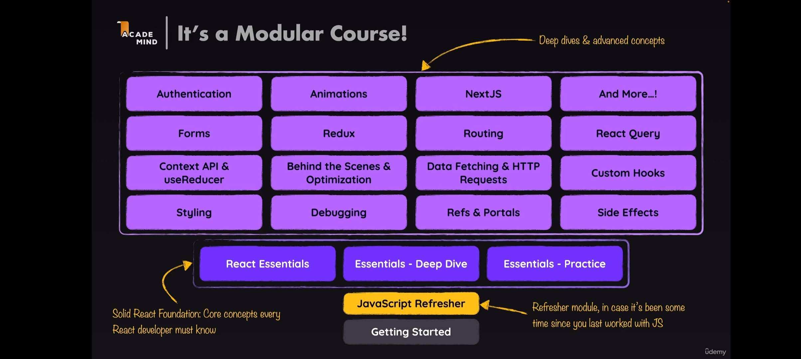
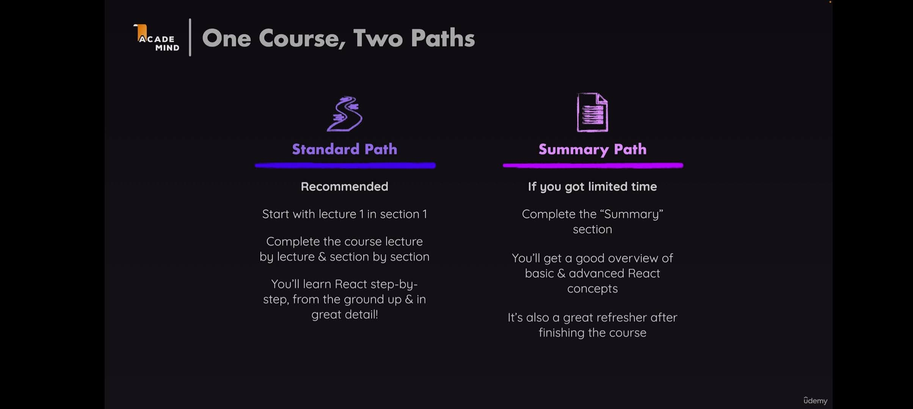

## Code Samples

[Vanilla JS Demo](https://codesandbox.io/p/sandbox/vanilla-js-demo-6049kj?file=%2Findex.html)

[React JS Demo](https://codesandbox.io/p/sandbox/react-vs-vanilla-demo-uc08fv?file=%2Fsrc%2Findex.js)

## Learning Paths to take this Course

### Modular Approach



### Summary Path



## Course Code

https://github.com/academind/react-complete-guide-course-resources

## To install react app

### Usual Option: 

``` bash
npx create-react-app app_name

# Runs the server
npm start
```

### Using Vite: 

``` bash
# defines the file structure
npm create vite@latest app_name
cd app_name
# installs the dependencies
npm install
# runs the server
npm run dev
```